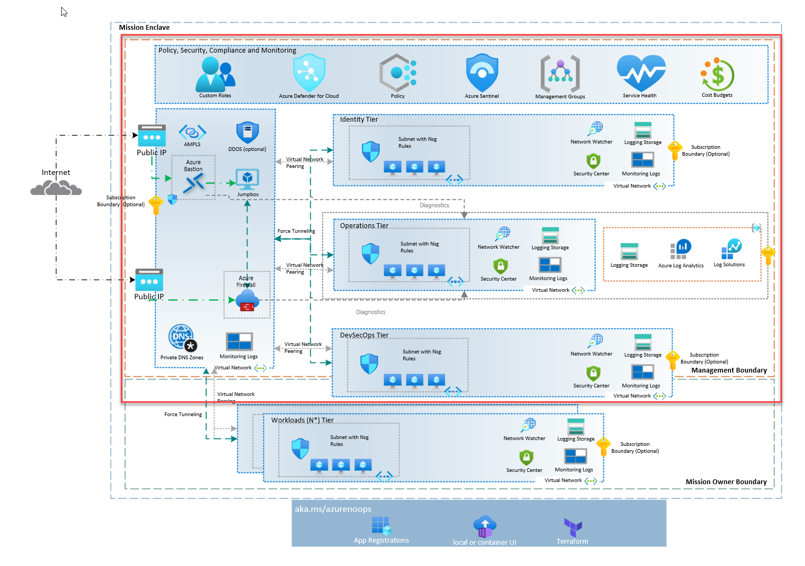
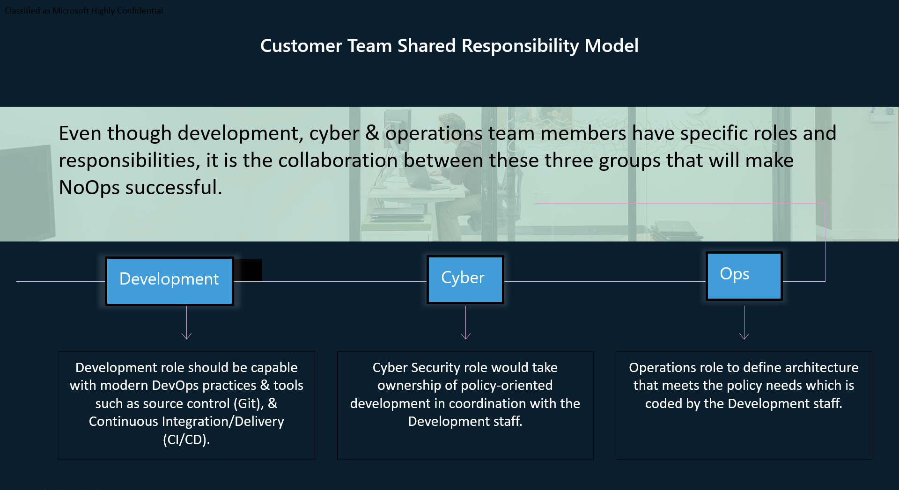

# Azure NoOps Mission Enclave Landing Zone starter #

Azure NoOps Mission Enclave Landing Zone starter is a highly opinionated Infrastructure-as-Code (IaC) Landing Zone which IT oversight organizations can use to create a cloud management system to deploy Azure environments for their workloads and teams.

Azure NoOps Mission Enclave Landing Zone starter addresses a narrowly scoped, specific need for a Secure Cloud Computing Architecture (SCCA) compliant hub and spoke infrastructure.

Goals of Azure NoOps Mission Enclave Landing Zone starter:

- Designed for US Government mission customers that have a small number of teams to operate cloud environments for their workloads
- Follows Zero Trust principles and implements a [Zero Trust architecture](https://aka.ms/zerotrust)
- Implements SCCA controls following Microsoft's [SACA](https://aka.ms/saca) implementation guidance
- Deployable in Azure commercial, Azure Government, Azure Government Secret, and Azure Government Top Secret clouds
- Written as [Terraform](./infrastructure/terraform/) templates
- Ability to consume workloads addons such as TAK Server, web apps, Azure SQL Database, and Azure Kubernetes Service (AKS)
- Use E2E [Github Actions](https://docs.github.com/en/actions/learn-github-actions/understanding-github-actions) as part of  pipelines to automate the deployment and removal of the entire infrastructure on multiple environments on the Azure platform.

## Table of Contents ##

- [Azure NoOps Mission Enclave Landing Zone starter](#azure-noops-mission-enclave-landing-zone-starter)
  - [Table of Contents](#table-of-contents)
  - [Getting Started](#getting-started)
    - [Prerequisites](#prerequisites)
    - [Architecture](#architecture)
  - [Deploy Manually with Terraform](#deploy-manually-with-terraform)
  - [Deploy with GitHub Actions](#deploy-with-github-actions)
  - [Importance of Separation of Duties (Azure NoOps Shared Responsibility Model)](#importance-of-separation-of-duties-azure-noops-shared-responsibility-model)
  - [Policy](#policy)
  - [Limitations](#limitations)
  - [Got feedback](#got-feedback)
  - [Data Collection](#data-collection)
  - [Contributing](#contributing)
  - [Legal Notices](#legal-notices)
  - [Trademarks](#trademarks)

## Getting Started ##

### Prerequisites ###

Before you begin, ensure you have met the following requirements:

- **Azure Subscription**: You need an Azure subscription to create resources in Azure. If you don't have one, you can create a [free account](https://azure.microsoft.com/free/).

- **Azure CLI or Azure PowerShell**: You need either Azure CLI or Azure PowerShell installed and configured to interact with your Azure account. You can download them from [here](https://docs.microsoft.com/en-us/cli/azure/install-azure-cli) and [here](https://docs.microsoft.com/en-us/powershell/azure/install-az-ps) respectively.

- **Terraform**: You will need Terraform installed to deploy the infrastructure. You can download Terraform from [here](https://www.terraform.io/downloads.html).

- **Knowledge of Azure Landing Zones**: This project involves deploying and managing Azure Landing Zones resources. Familiarity with Azure Landing Zones and its concepts is recommended.

Please replace the links and the software versions with the ones that are relevant to your project.

### Architecture ###

The following picture shows the high-level architecture created by the Terraform modules included in this Azure NoOps Mission Enclave Landing Zone starter:

## Deploy Manually with Terraform ##

You can deploy Azure NoOps Mission Enclave Landing Zone using the Terraform CLI. The Terraform CLI will deploy the infrastructure to the Azure subscription you have configured in the Terraform CLI.

You must have [Owner RBAC permissions](https://docs.microsoft.com/en-us/azure/role-based-access-control/built-in-roles#owner) to the subscription(s) you deploy Azure NoOps Mission Enclave Landing Zone into.

The below scenario is how to get started on the Mission Enclave Landing Zone implementation manually. This implementation has a detailed README.md that will walk you through the deployment steps.

Manual Deployment Details:
| Deployment Methodology | Manual Deployment |
|--------------|--------------|
|Terraform|[Published](https://azurenoops.github.io/terraform-overlays-baseline/deployment/landing-zone-manual)|

>NOTE: Using manual deployment to deploy the infrastructure using the Terraform CLI. This is a good option if you want to learn how to deploy the infrastructure using Terraform CLI.

## Deploy with GitHub Actions ##

You can deploy Azure NoOps Mission Enclave Landing Zone using the GitHub Actions. The GitHub Actions will deploy the infrastructure to the Azure subscription you have configured in the GitHub Secrets.

You must have [Owner RBAC permissions](https://docs.microsoft.com/en-us/azure/role-based-access-control/built-in-roles#owner) to the subscription(s) you deploy Azure NoOps Mission Enclave Landing Zone into.

The below scenario is how to get started on the Mission Enclave Landing Zone implementation with GitHub Actions. This implementation has a detailed README.md that will walk you through the deployment steps.

E2E GitHub Deployment Details:
| Deployment Methodology | GitHub Actions | Azure DevOps |
|--------------|--------------|--------------|
|Terraform|[In Progress](https://azurenoops.github.io/terraform-overlays-baseline/deployment/landing-zone-github)| Coming soon |

## Importance of Separation of Duties (Azure NoOps Shared Responsibility Model) ##

In this is a reference implementation, the repo is self contained and contains all the Terraform modules and configuration files to deploy the infrastructure on Azure. This does not take into account of roles. Azure NoOps Shared Responsibility Model pushes the need to separate roles.

In a production environment, you will need to separate the Terraform modules and configuration files into different repositories. For example, you can have the following repositories:

- A repository for the Management Layer Terraform modules (includes management groups, management service such as budgets, landing zones, and shared services)
- A repository for the Management Policy Terraform modules
- A repository for the Workload Terraform modules (includes workload spoke and workload services such as web app, and Azure SQL Database)

The following picture shows the separation of duties for the Terraform modules and configuration files:

It is important to understand how you would set this up for a production environment. The separation of duties is important to ensure that the Terraform modules can be reused across multiple environments and allows the right role to control changes.

## Policy ##

Policy is a important piece of an Mission Enclave and required for a ATO to your environment. It is too broad of a topic to add to this reference implementation.

If you are interested in learning more about how to apply policy to use in an Mission Enclave, you can use the following resources:

- [Azure NoOps Policy Starter](https://github.com/azurenoops/ref-scca-enclave-policy-starter)

However, you can use the following resources to learn more about policy in general:

- [Azure Policy](https://docs.microsoft.com/en-us/azure/governance/policy/overview)

## Limitations ##

## Got feedback ##

Please leverage issues if you have any feedback or request on how we can improve on this repository.

## Data Collection ##

The software may collect information about you and your use of the software and send it to Microsoft. Microsoft may use this information to provide services and improve our products and services. You may turn off the telemetry as described in the repository. There are also some features in the software that may enable you and Microsoft to collect data from users of your applications.

If you use these features, you must comply with applicable law, including providing appropriate notices to users of your applications together with a copy of Microsoft's privacy statement. Our privacy statement is located at <https://go.microsoft.com/fwlink/?LinkId=521839>.

You can learn more about data collection and use in the help documentation and our privacy statement. Your use of the software operates as your consent to these practices.

## Contributing ##

This project welcomes contributions and suggestions.  Most contributions require you to agree to a
Contributor License Agreement (CLA) declaring that you have the right to, and actually do, grant us
the rights to use your contribution. For details, visit <https://cla.opensource.microsoft.com>.

When you submit a pull request, a CLA bot will automatically determine whether you need to provide
a CLA and decorate the PR appropriately (e.g., status check, comment). Simply follow the instructions
provided by the bot. You will only need to do this once across all repos using our CLA.

This project has adopted the [Microsoft Open Source Code of Conduct](https://opensource.microsoft.com/codeofconduct/).
For more information see the [Code of Conduct FAQ](https://opensource.microsoft.com/codeofconduct/faq/) or
contact [opencode@microsoft.com](mailto:opencode@microsoft.com) with any additional questions or comments.

## Legal Notices ##

Microsoft and any contributors grant you a license to the Microsoft documentation and other content
in this repository under the [Creative Commons Attribution 4.0 International Public License](https://creativecommons.org/licenses/by/4.0/legalcode),
see the [LICENSE](LICENSE) file, and grant you a license to any code in the repository under the [MIT License](https://opensource.org/licenses/MIT), see the
[LICENSE-CODE](LICENSE-CODE) file.

Microsoft, Windows, Microsoft Azure and/or other Microsoft products and services referenced in the documentation
may be either trademarks or registered trademarks of Microsoft in the United States and/or other countries.
The licenses for this project do not grant you rights to use any Microsoft names, logos, or trademarks.
Microsoft's general trademark guidelines can be found at <http://go.microsoft.com/fwlink/?LinkID=254653>.

Privacy information can be found at <https://privacy.microsoft.com/en-us/>

Microsoft and any contributors reserve all other rights, whether under their respective copyrights, patents,
or trademarks, whether by implication, estoppel or otherwise.

## Trademarks ##

This project may contain trademarks or logos for projects, products, or services. Authorized use of Microsoft
trademarks or logos is subject to and must follow
[Microsoft's Trademark & Brand Guidelines](https://www.microsoft.com/legal/intellectualproperty/trademarks/usage/general).
Use of Microsoft trademarks or logos in modified versions of this project must not cause confusion or imply Microsoft sponsorship.
Any use of third-party trademarks or logos are subject to those third-party's policies.
